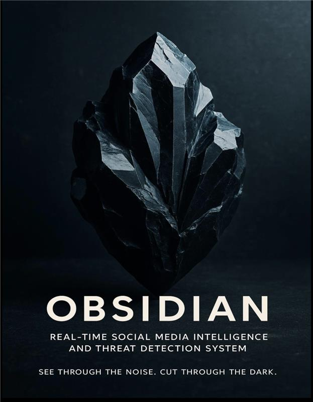

<p align="center">
  
</p>

# OBSIDIAN

**OBSIDIAN** is a Streamlit-based Arabic social media intelligence prototype that classifies Arabic tweets and short texts using a fine-tuned AraBERT model. It supports single-text prediction, batch file prediction, and a live-monitoring workflow that can simulate or fetch near real-time Arabic tweets through an n8n webhook.

OBSIDIAN is part of a broader research project titled:

> **OBSIDIAN — Real-Time Social Media Intelligence and Threat Detection System**

The project aims to transform unstructured Arabic public social media content into structured, actionable insights for institutional awareness, early warning, and decision support.

---

## Table of Contents

- [Project Overview](#project-overview)
- [Research and Academic Context](#research-and-academic-context)
- [Current Features](#current-features)
- [Label Definitions](#label-definitions)
- [System Architecture](#system-architecture)
- [Repositories and Hosting](#repositories-and-hosting)
- [Project Structure](#project-structure)
- [Installation](#installation)
- [How to Run Locally](#how-to-run-locally)
- [How to Use the App](#how-to-use-the-app)
  - [Single Text Mode](#single-text-mode)
  - [Batch Upload Mode](#batch-upload-mode)
  - [Live Monitor Mode](#live-monitor-mode)
- [n8n Webhook Configuration](#n8n-webhook-configuration)
- [Sample Test Files](#sample-test-files)
- [Preprocessing and Inference Notes](#preprocessing-and-inference-notes)
- [Model Hosting Details](#model-hosting-details)
- [Ethical and Responsible Use](#ethical-and-responsible-use)
- [Limitations](#limitations)
- [Future Roadmap](#future-roadmap)
- [Project Information](#project-information)

---

## Project Overview

OBSIDIAN is designed to analyze Arabic tweets and short social-media texts and classify them into five operational categories:

- **Threat**
- **Violence**
- **Distress**
- **Complaint**
- **Neutral**

The system is motivated by the need for Arabic-aware monitoring tools that understand meaning, not just keywords. Arabic online discourse can be noisy, dialectal, sarcastic, implicit, and context-dependent, which makes simple keyword matching unreliable for institutional or security-oriented use cases.

The current application is an engineering and deployment layer built around a fine-tuned AraBERT model. It provides a practical interface for reviewing predictions, confidence scores, class distributions, alert levels, and downloadable outputs.

---

## Research and Academic Context

OBSIDIAN was developed as a graduate project under King Fahd University of Petroleum & Minerals (KFUPM). The broader research direction focuses on real-time public discourse analysis, Arabic NLP, early-risk detection, and interactive dashboards for institutional awareness.

The original project proposal defines OBSIDIAN as an intelligent platform for monitoring, analyzing, and classifying social media content from platforms such as Twitter/X, YouTube, and Telegram. The system is intended to support public-sector, academic, governmental, and security-oriented stakeholders by converting real-time public discourse into structured insights.

The progress report describes the project as having moved from conceptual design toward technical maturity through:

- large-scale Arabic social media data collection,
- custom dataset construction,
- data cleaning and filtering,
- baseline experimentation,
- transformer-based modeling,
- robustness validation on noisy real-world Arabic content,
- and preparation for downstream operational extensions such as live ingestion, dashboards, alerts, and role-based access control.

---

## Current Features

### 1. Single Text Classification

The app allows users to enter one Arabic tweet or sentence and receive:

- predicted label,
- confidence score,
- probability distribution chart,
- class probability table.

### 2. Batch Upload Classification

The app supports CSV and XLSX uploads for classifying multiple texts at once.

It provides:

- uploaded data preview,
- automatic text-column detection,
- selected text-column preview,
- batch prediction results,
- predicted label distribution chart,
- downloadable CSV output.

Supported text column names include:

- `cleaned_text`
- `text`
- `tweet`
- `tweet_text`
- `content`

Column detection is case-insensitive.

### 3. Live Monitor

The Live Monitor tab adds the project’s near-real-time monitoring layer.

It supports two modes:

#### Demo Simulation

Uses sample Arabic tweets to simulate live monitoring without requiring external services.

#### n8n Webhook

Connects to an n8n workflow that fetches Arabic tweets using Abdullah’s live workflow parameters:

- `postLimit`
- `timeWindowHours`
- `xQuery`

The Live Monitor displays:

- fetched tweet preview,
- tweet ID,
- KSA-formatted timestamp,
- author ID,
- tweet text,
- predicted label,
- confidence,
- alert level,
- label distribution chart,
- alert-level chart,
- all classified tweets,
- downloadable CSV and Excel outputs.

The live-monitoring logic includes retry support to handle intermittent webhook or external API instability.

---

## Label Definitions

### Threat

Text that includes direct or indirect threats, intimidation, or intent to cause harm.

**Example:**  
`سأقتلك إذا رأيتك مرة أخرى`

### Violence

Text describing physical aggression, assault, attack, or violent incidents.

**Example:**  
`قاموا بضرب الرجل في الشارع بعنف شديد`

### Distress

Text expressing fear, panic, emotional suffering, helplessness, or need for help.

**Example:**  
`أنا خائف جدًا ولا أعرف ماذا أفعل، أحتاج مساعدة`

### Complaint

Text expressing dissatisfaction, frustration, criticism, or reporting a service or product issue.

**Example:**  
`الخدمة سيئة جدًا والتطبيق يتعطل كل مرة`

### Neutral

Text that does not strongly indicate threat, violence, distress, or complaint.

**Example:**  
`الجو اليوم معتدل والناس في الحديقة`

---

## System Architecture

The current deployed-style setup is:

- **GitHub** hosts the Streamlit application code.
- **Hugging Face** hosts the fine-tuned AraBERT model files.
- **Streamlit** runs the user interface.
- **n8n** can optionally provide near-real-time tweet retrieval through a webhook.
- The app loads the model from the Hugging Face model repository:
  - `SoftALL/OBSIDIAN`

This design keeps the large model file outside the GitHub repository and allows the application to load the model directly through Hugging Face Transformers.

---

## Repositories and Hosting

### GitHub Repository

- Organization: **SoftALL**
- Repository: **OBSIDIAN**

### Hugging Face Model Repository

- Organization: **SoftALL**
- Model repository: **OBSIDIAN**

### Streamlit App

- Deployment: Streamlit Community Cloud or local Streamlit execution
- The deployed app may require a short startup time because the model is loaded from Hugging Face.

---

## Project Structure

```text
OBSIDIAN/
│
├── app.py
├── requirements.txt
├── README.md
├── .gitignore
│
├── .streamlit/
│   └── config.toml
│
├── assets/
│   ├── Crystal.png
│   ├── obsidian_logo.png
│   └── obsidian_banner.jpeg
│
├── src/
│   ├── inference.py
│   ├── preprocess.py
│   ├── labels.py
│   ├── batch.py
│   ├── live.py
│   └── utils.py
│
├── model/
│   ├── config.json
│   ├── tokenizer.json
│   └── tokenizer_config.json
│
├── data_samples/
│   ├── sample_test.csv
│   └── live_tweets_sample.csv
│
└── outputs/
    └── .gitkeep
```

---

## Installation

### 1. Clone the repository

```bash
git clone https://github.com/SoftALL/OBSIDIAN.git
cd OBSIDIAN
```

### 2. Create and activate a virtual environment

#### macOS / Linux

```bash
python3 -m venv .venv
source .venv/bin/activate
```

#### Windows

```bash
python -m venv .venv
.venv\Scripts\activate
```

### 3. Install dependencies

```bash
pip install --upgrade pip
pip install -r requirements.txt
```

---

## How to Run Locally

Run the Streamlit app with:

```bash
streamlit run app.py
```

Then open the local URL shown in the terminal, usually:

```text
http://localhost:8501
```

### Important Notes

Because the app loads the model from Hugging Face, the first run may take some time while the model is downloaded and cached. Later runs are usually faster on the same machine.

---

## How to Use the App

### Single Text Mode

1. Open the **Single Text** tab.
2. Enter one Arabic sentence or tweet.
3. Click **Predict**.
4. Review:
   - predicted label,
   - confidence score,
   - probability chart,
   - class probability table.

### Batch Upload Mode

1. Open the **Batch Upload** tab.
2. Upload a CSV or XLSX file.
3. Select the text column to classify.
4. Click **Run Batch Prediction**.
5. Review:
   - uploaded data preview,
   - selected text column preview,
   - classified results preview,
   - predicted label distribution chart.
6. Download the full output as CSV.

### Live Monitor Mode

1. Open the **Live Monitor** tab.
2. Select either:
   - **Demo Simulation**, or
   - **n8n Webhook**.
3. Choose the number of tweets to process.
4. If using n8n mode, configure:
   - time window in hours,
   - X/Twitter query,
   - webhook URL through Streamlit secrets or manual input.
5. Click **Fetch and Classify Live Tweets**.
6. Review:
   - fetched tweet preview,
   - total tweets,
   - high/medium alerts,
   - average confidence,
   - dominant label,
   - high/medium alert tweets,
   - label distribution,
   - alert-level distribution,
   - all classified live tweets.
7. Download live results as CSV or Excel.

---

## n8n Webhook Configuration

The live mode can connect to an n8n workflow using the following query parameters:

```text
postLimit
timeWindowHours
xQuery
```

For secure deployment, store the webhook URL in Streamlit secrets instead of hardcoding it.

### Local Secrets Example

Create:

```text
.streamlit/secrets.toml
```

Add:

```toml
N8N_WEBHOOK_URL = "YOUR_N8N_WEBHOOK_URL_HERE"
```

### Important Security Note

Do not commit `.streamlit/secrets.toml` if it contains a real webhook URL.

Add this to `.gitignore`:

```text
.streamlit/secrets.toml
```

---

## Sample Test Files

A small sample batch file is included for quick testing:

```text
data_samples/sample_test.csv
```

A demo live-monitoring sample file may also be included:

```text
data_samples/live_tweets_sample.csv
```

---

## Preprocessing and Inference Notes

The app uses lightweight preprocessing to stay close to the model’s expected input style.

Current preprocessing includes:

- handling missing values,
- converting values to strings,
- trimming whitespace,
- collapsing repeated spaces,
- using n8n-provided `cleanText` when available,
- formatting live timestamps into KSA dashboard time.

The app avoids aggressive cleaning, stemming, or lemmatization because Arabic threat, distress, complaint, and dialectal signals can depend on surface wording, punctuation, emojis, and context.

Inference uses:

- Hugging Face Transformers,
- the `SoftALL/OBSIDIAN` model repository,
- `max_length=128`,
- batch inference for uploaded files and live-monitoring workflows.

---

## Model Hosting Details

The fine-tuned model is hosted on Hugging Face:

```text
SoftALL/OBSIDIAN
```

The Hugging Face model repository contains:

- `config.json`
- `model.safetensors`
- `tokenizer.json`
- `tokenizer_config.json`

Important notes:

- the large `model.safetensors` file is not tracked inside the GitHub application repository,
- the application loads the model using `AutoTokenizer.from_pretrained()` and `AutoModelForSequenceClassification.from_pretrained()`,
- the local `model/` folder keeps small configuration/tokenizer files only for organization and reference.

---

## Ethical and Responsible Use

OBSIDIAN is intended for research, demonstration, and decision-support workflows.

It should not be used as the sole basis for enforcement, disciplinary action, or high-stakes decisions. Predictions should be reviewed by qualified human analysts, especially for sensitive categories such as Threat, Violence, and Distress.

The system should only process publicly available data accessed through legal and ethical mechanisms. Monitoring of private, encrypted, or direct-message content is outside the intended scope of this prototype.

---

## Limitations

- The current deployed model focuses on Arabic tweet and short-text classification.
- Performance may degrade on long texts, mixed-language content, OCR artifacts, or content outside the training distribution.
- Some categories can overlap semantically, especially Threat vs. Distress or Complaint vs. Neutral.
- n8n live fetching depends on the availability and stability of the external workflow and upstream data source.
- Live Monitor mode is a prototype/near-real-time simulation layer, not a full production monitoring system.
- The system currently does not perform full social network analysis, geospatial tracking, or cross-platform influencer analysis in the Streamlit app.

---

## Future Roadmap

Future extensions may include:

- expanded multilingual support,
- YouTube and Telegram ingestion,
- role-based access control,
- institution-specific dashboards,
- entity-aware search,
- trend origin tracking,
- influencer/account monitoring,
- geospatial analysis,
- automated alert workflows,
- PDF/Excel reporting,
- integration with secure institutional systems.

---

## Project Information

### Project

**OBSIDIAN — Real-Time Social Media Intelligence and Threat Detection System**

### Researcher / Project Owner

**Abdullah Saeed Ali Al-Malki**

### Academic Affiliation

- **University:** King Fahd University of Petroleum & Minerals (KFUPM)
- **College:** College of Computing and Mathematics
- **Department:** Department of Computer Engineering / Computer Networks Program
- **Degree Program:** Master’s Degree in Computer Engineering
- **Academic Year:** 2024–2026

### Supervisor

**Dr. Saad Ezzini**  
Assistant Professor — Software Engineering  
Information & Computer Science Department

### Institutional / Professional Context

- **Sector:** Ministry of Interior — Public Security
- **Department:** Eastern Province Police
- **Current Role:** Director of Communications and Information Technology Division

### Contact

- **Email:** ASALMALKI@POLICE.MOI.GOV.SA

> Public repository note: personal identifiers such as national ID and personal phone number are intentionally not included in this README. Add public contact information only with the project owner’s approval.

---

## Acknowledgment

This application layer was prepared to help organize, deploy, and demonstrate the OBSIDIAN Arabic tweet classification workflow as a clean Streamlit project connected to a Hugging Face-hosted fine-tuned AraBERT model.
